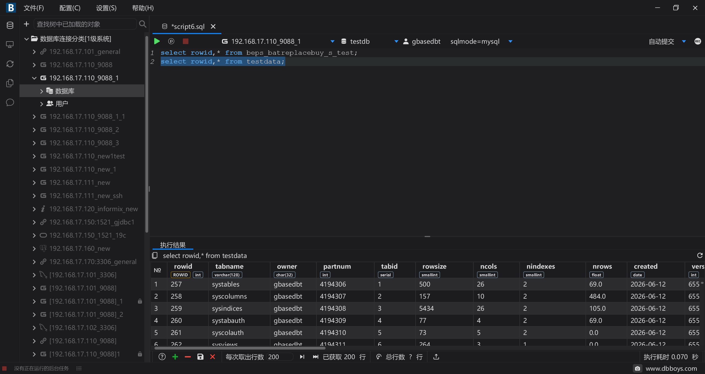
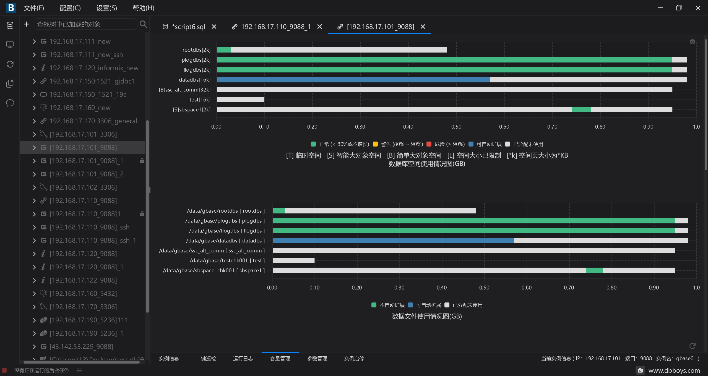
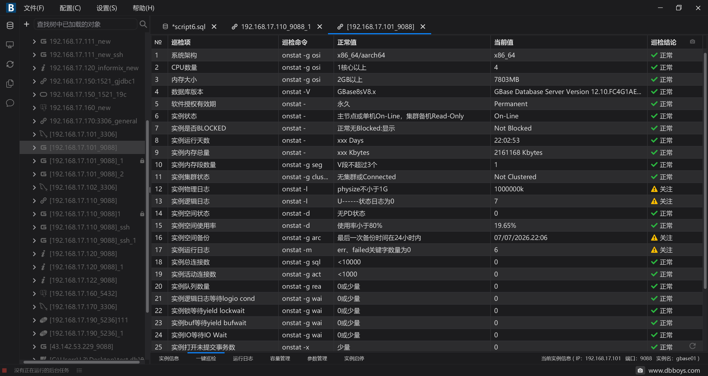
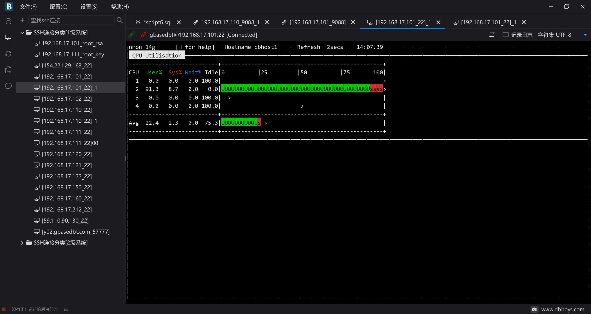
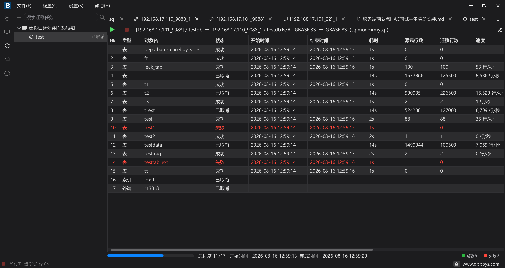

<div align="center">

# 🐬 DBboys

**新一代开源数据库开发与运维客户端**

*装 · 用 · 管 · 卸 — 数据库全生命周期管理*

[](https://www.gnu.org/licenses/gpl-3.0)
[]()
[]()
[]()
[]()
[]()

[功能特性](#-功能特性) · [界面预览](#-界面预览) · [数据库适配](#-数据库适配说明) · [从源码构建](#-从源码构建) · [技术栈](#-技术栈) · [许可](#-许可) · [更新日志](CHANGELOG.md)

</div>

---

## ✨ 功能特性

- **数据库远程安装 / 卸载** — 向导式远程部署 GBase 8S、Informix、MySQL、Oracle、达梦
- **对象浏览与管理** — 树形浏览模式/表/视图/索引/存储过程，支持 DDL 查看与编辑
- **SQL 工作台** — 语法高亮、智能补全、执行计划、批量执行、结果集编辑与导出
- **实例管理** — 一键巡检、运行日志、容量图表、参数管理、实例启停
- **SSH 终端** — 内置 SSH 连接与 SFTP 文件传输
- **知识库** — Markdown 文档管理，Lucene + IK 分词全文检索
- **AI 助手** — 支持 OpenAI、豆包、DeepSeek、Kimi、Qwen 等模型

---

## 📸 界面预览

<a href="docs/DBBOYS/images/img1.png"></a>
<a href="docs/DBBOYS/images/img2.png"></a>
<a href="docs/DBBOYS/images/img3.png"></a>
<a href="docs/DBBOYS/images/img4.png"></a>
<a href="docs/DBBOYS/images/img5.png"></a>

---

## 🗃️ 数据库适配说明

| 数据库 | 连接 | SQL工作台 | 对象浏览 | DDL | 巡检 | 空间管理 | 参数管理 | 远程安装 | 实例启停 |
|--------|:----:|:--------:|:--------:|:---:|:----:|:--------:|:--------:|:--------:|:--------:|
| **GBase 8S** | ✅ | ✅ | ✅ | ✅ | ✅ | ✅ | ✅ | ✅ | ✅ |
| **Informix** | ✅ | ✅ | ✅ | ✅ | ✅ | ✅ | ✅ | ✅ | ✅ |
| **MySQL** | ✅ | ✅ | ✅ | ✅ | ✅ | ✅ | ✅ | ✅ | — |
| **Oracle** | ✅ | ✅ | ✅ | ✅ | ✅ | ✅ | ✅ | ✅ | — |
| **PostgreSQL** | ✅ | ✅ | ✅ | ✅ | — | — | — | — | — |
| **达梦 (DM)** | ✅ | ✅ | ✅ | ✅ | ✅ | ✅ | ✅ | ✅ | — |
| **SQLite** | ✅ | ✅ | ✅ | ✅ | — | — | — | — | — |
| **通用 JDBC** | ✅ | ✅ | ✅ | ✅ | — | — | — | — | — |

> 适配能力依赖数据库类型、驱动、用户权限和版本。应用菜单 `帮助 → 适配列表` 可查看详细适配项。

---

## 📦 从源码构建

### Windows x64

1. 安装 JDK 25.0.2，确保 JDK `bin` 目录在 `PATH` 中
2. 修改 `build.bat` 中的 `JAVAFX_JMODS`，指向本机 JavaFX jmods 目录
3. 在项目根目录执行：

   ```bat
   build.bat
   ```

4. 脚本编译源码、复制资源、通过 `jlink` 生成运行时、通过 `jpackage` 打包 app-image，最终在 `build/dist/` 下输出 `dbboys.zip`（所有中间产物均位于 `build/` 目录，已 gitignore）
5. 解压 `dbboys.zip` 后运行 `dbboys/bin/dbboys.exe`

### Linux x64

1. 安装 JDK 25.0.2，确保 JDK `bin` 目录在 `PATH` 中
2. 修改 `build.sh` 中的 `JAVAFX_JMODS`，指向本机 JavaFX jmods 目录
3. 在项目根目录执行：

   ```shell
   sh build.sh
   ```

4. 脚本编译源码、复制资源、通过 `jlink` 生成运行时、通过 `jpackage` 打包 app-image，最终在 `build/dist/` 下输出 `dbboys.zip`
5. 解压 `dbboys.zip` 后运行 `sh start.sh`

### Linux aarch64 (ARM64)

> 官方 JavaFX jmods 的 glibc 版本较高，部分系统需要自行编译。

**前置步骤 — 编译 JavaFX jmods：**

1. 安装 OpenJDK 22 (build 22+36-2370)，gcc ≥ 7.5
2. 下载 jfx 源码 `jfx-25-3`
3. 编辑 `modules/javafx.graphics/src/main/native-glass/gtk/PlatformSupport.cpp`，末尾添加：

   ```cpp
   constexpr const char* PlatformSupport::OBSERVED_SETTINGS[];
   ```

   > 否则 `libglassgtk3.so` 中 `OBSERVED_SETTINGS` 可能未定义。验证：`nm -D build/modular-sdk/modules_libs/javafx.graphics/libglassgtk3.so | grep OBSERVED_SETTINGS`，显示 `D` 为正常，`U` 为未定义。

4. 编译 jmods：

   ```shell
   cd jfx-25-3
   chmod 777 gradlew
   ./gradlew jmods
   ```

**构建 DBboys：**

1. 安装 JDK 25.0.2，确保 JDK `bin` 目录在 `PATH` 中
2. 修改 `build.sh` 中的 `JAVAFX_JMODS`，指向上一步编译好的 JavaFX jmods 目录
3. 在项目根目录执行：

   ```shell
   sh build.sh
   ```

4. 最终输出 `dbboys.zip`，解压后运行 `sh start.sh`

---

## 🏗️ 技术栈

| 组件 | 技术 |
|------|------|
| UI 框架 | JavaFX 25.0.3 |
| SSH / SFTP | Apache MINA SSHD |
| 全文检索 | Apache Lucene + IK Analyzer |
| Excel 导入导出 | Apache POI |
| JSON 解析 | org.json |
| 日志 | Apache Log4j 2 |
| 构建 | jlink + jpackage |

---

## 📄 许可

本项目基于 [GNU General Public License v3.0](LICENSE) 开源许可。
